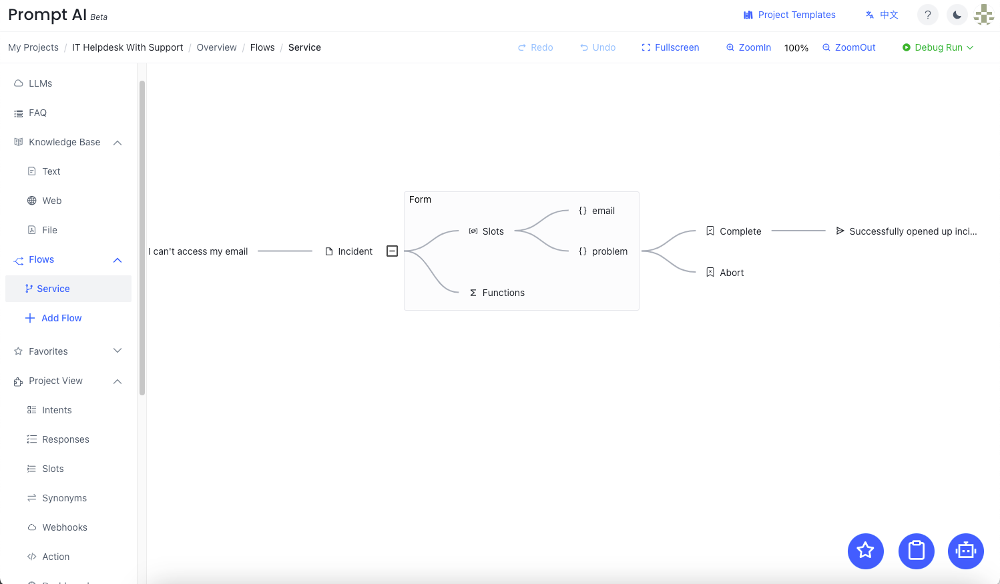

# IT Helpdesk

基于[Web Knowledge Base](/docs/quick_start/knowledge_base/) 拓展实现IT Helpdesk功能。

功能清单：
- 用户登录后，打开 Chatbot框可识别到用户名（email等其他信息）
- 回答不上的问题用户可自助提交工单

## 创建Service Flow
Service flow 可收集用户问题，并自动生成工单。

具体实现：
- [文本教程](/docs/tutorial/form/)
- [视频教程](/docs/example/form/)

## 自动加载用户名

登录系统后，在右上角点击进行"Create Project"进行项目创建。

这里我们输入必要的信息：
- 名称: PromptAI Helper
- 描述：PromptAI documents chatbot
- 欢迎语：Welcome to using PromptAI ! I can answer your related questions.

2、添加URL Web知识库
进入项目后，依次点击："Knowledge Base" - "Web" 进入 Web 知识库管理界面

点击"Add"可进入Web添加界面,在URL中输入PromptAI帮助文档的首页：https://doc.promptai.us/docs/about/

PromptAI帮助文档由多个页面构成，所以需要解析其他帮助页面。点击"Parse"按钮可进行解析，在下方可看到解析后的页面地址。

过滤：
- 使用"Filer"通过关键字对链接筛选
- URL 左侧的选择框

这里我们默认使用全选，点击右下角"OK"即可。

接下来系统将自动解析页面，进行知识库初始化。

初始化完成后，所有的 URL 状态变为"complete"

3、添加FAQ知识库
点击左侧："FAQ" 进入FAQ管理界面

这里我们添加第一个FAQ来回答 "Who are you?" 这个问题.

- User Question: 用户可能会询问的问题
- Bot  Response: 展示的回答

点击右上角保存即可。

*更多 FAQ示例请访问[FAQ](/docs/tutorial/faq/)*

## 发布与对话
经过简单的两个步骤，我们完成了知识库的构建：
- 添加并解析PromptAI 文档：https://doc.promptai.us/docs/about/
- 添加FAQ：Who are you?

### 发布
接下来进行最后的发布流程：依次点击："Project Tool" - "Release" 进入发布管理界面

接下来点击"Faq"将 Faq 选中，最后点击"Click to release"上方的图标进行发布。

数秒后发布成功并弹出对话框：

### 对话

接下来我们试试对话效果
- 询问: who are yor?
- 询问： What PromptAI can do?

For now, 我们的 PromptAI Helper 构建已完成。仅需少数几步输入与点击即可完成知识库的构建。
## 报表

PromptAI对用户提供了报表功能，用户可以查看项目的使用情况，包括访问量、问答量、TopN等。

## 使用建议
不仅支持URL，PromptAI还支持Text和File其他两种类型的知识库。三种不同类型的知识库可结合起来一起工作，提供更好的服务使用体验。

## 常见问题解答

1、知识库相关问题回答可否优化？
> 知识库问答基于LLM的生成总结能力，回答的内容有一定不可预测性及单一性（text类型回复）。
> 
> 可将相关的问题创建为一个FAQ，在FAQ的回答中填入文本、图片及附件等类型的回答。

步骤：

- 在报表中查找用户输入

- 创建 FAQ

这里基于 Web 回复添加 PromptAI 的 logo

- 发布与对话

输入类似的问题，回答已由FAQ进行回复。

